<En>

MC-Vector is built on **Tauri v2**, a framework that bundles a Rust binary and a web-based UI (React + Vite) into a single native desktop application. This page documents how the major subsystems connect.

## High-Level Architecture

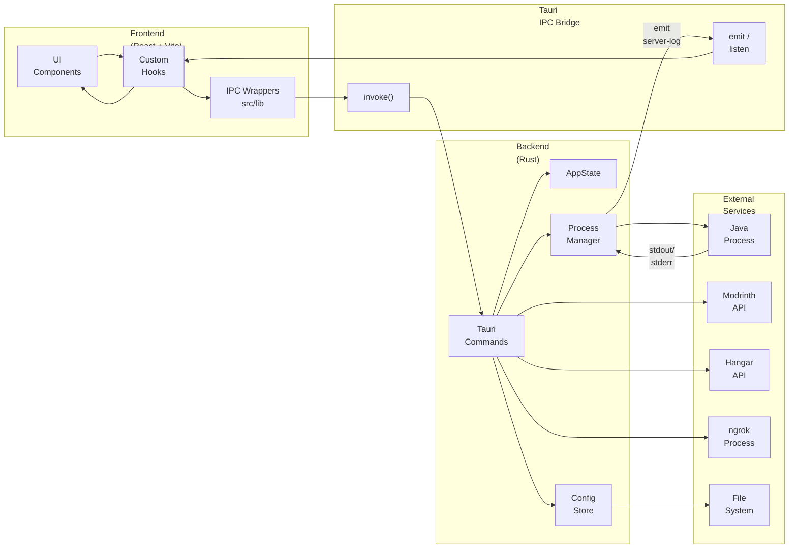

## Server Lifecycle Flow

This flowchart shows what happens when a user starts and stops a Minecraft server.

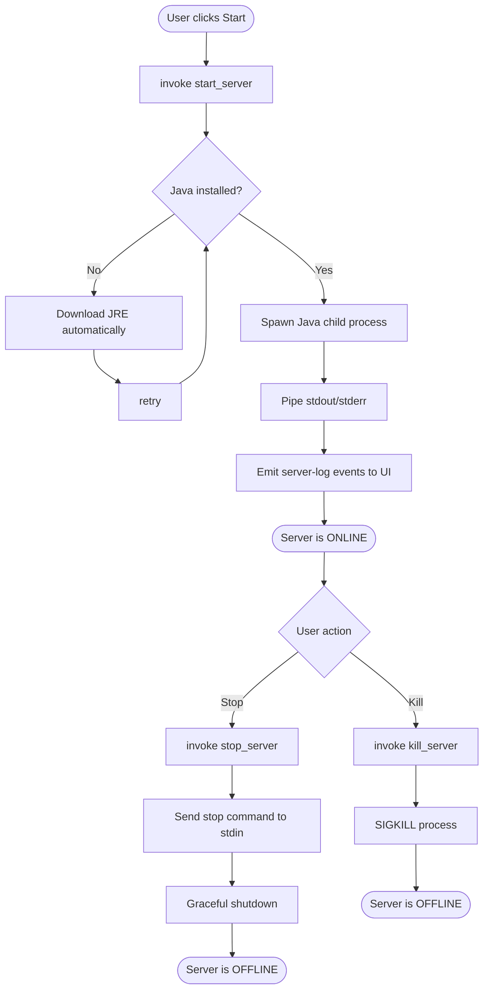

## IPC Communication

All UI ↔ Rust communication uses Tauri's `invoke` function. There is no HTTP server.

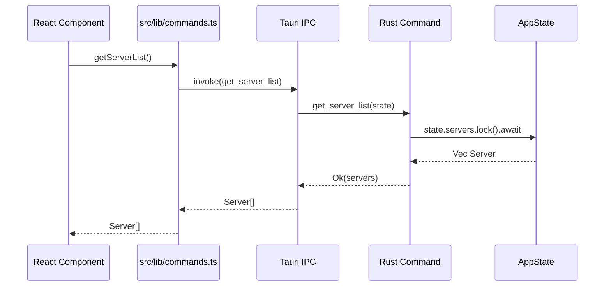

## Log Streaming Pipeline

Server log lines flow from the Java process to the React UI through Tauri events.

```mermaid
flowchart LR
  A["Java Process<br/>stdout"] -->|line by line| B["tokio<br/>BufReader"]
  B -->|trim and<br/>clone| C["app_handle<br/>.emit"]
  C -->|WebView<br/>IPC| D["listen<br/>server-log"]
  D -->|filter by<br/>server_id| E["React<br/>useState"]
  E -->|last 2000<br/>lines| F["Buffer<br/>Cap"]
  F -->|parse| G["ANSI<br/>Parser"]
  G -->|colorize| H["Console<br/>UI"]
  H -->|scroll<br/>guard| I["Auto-scroll<br/>on new log"]
  style A fill:#1f2d23,stroke:#00e599,stroke-width:2px
  style B fill:#1f2937,stroke:#6b7280,color:#e5e7eb
  style C fill:#1f2937,stroke:#6b7280,color:#e5e7eb
  style D fill:#1f2937,stroke:#6b7280,color:#e5e7eb
  style E fill:#1f2937,stroke:#6b7280,color:#e5e7eb
  style F fill:#1f2937,stroke:#6b7280,color:#e5e7eb
  style G fill:#1f2937,stroke:#6b7280,color:#e5e7eb
  style H fill:#1f2937,stroke:#6b7280,color:#e5e7eb
  style I fill:#1f2d23,stroke:#00e599,stroke-width:2px
```

## Plugin Download Flow

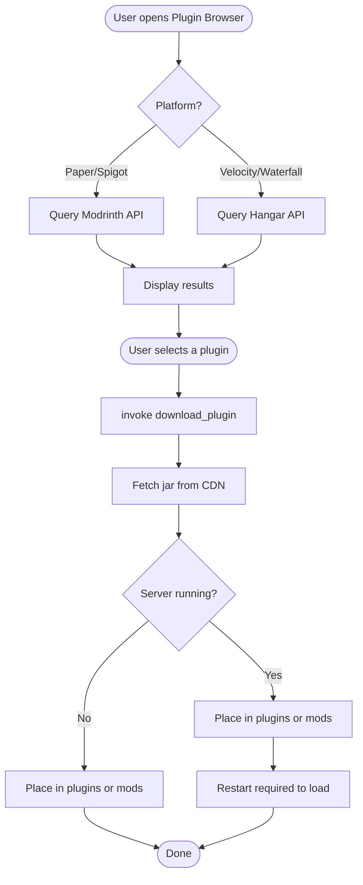

## Data Persistence

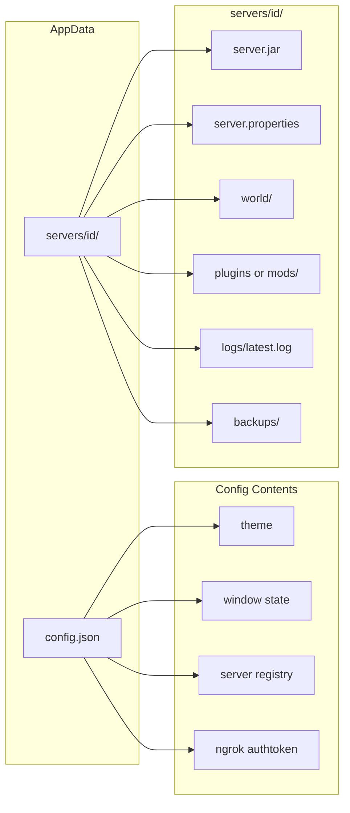

</En>

<Ja>

MC-Vectorは**Tauri v2**フレームワーク上に構築されており、RustバイナリとWebベースのUI（React + Vite）を単一のネイティブデスクトップアプリケーションとしてバンドルしています。

## 高レベルアーキテクチャ

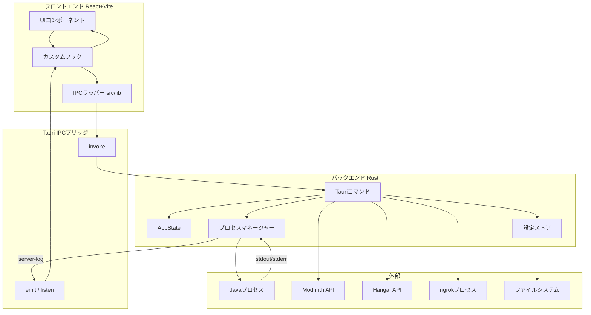

## サーバーライフサイクルフロー

ユーザーがサーバーを起動・停止するときに何が起きるかを示します。

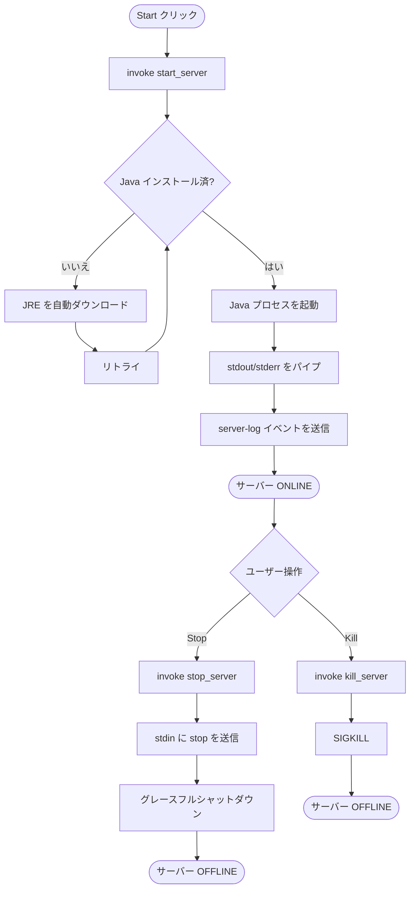

## IPC通信フロー

すべてのUI ↔ Rust通信はTauriの`invoke`を使用します。HTTPサーバーは存在しません。

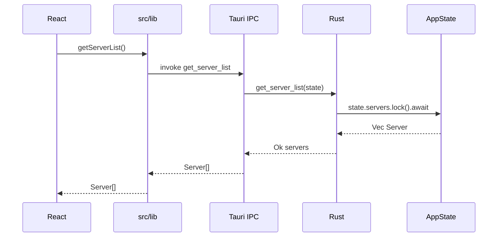

## ログストリーミングパイプライン

サーバーのログラインがJavaプロセスからReact UIまで流れる経路です。

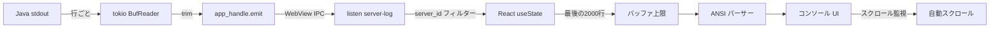

## プラグインダウンロードフロー

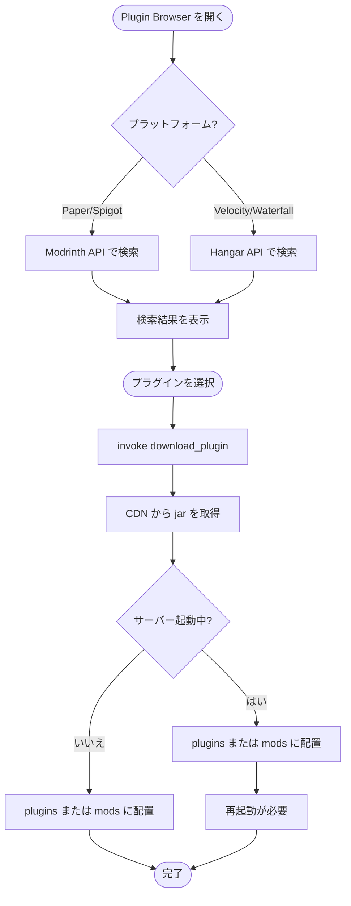

</Ja>
